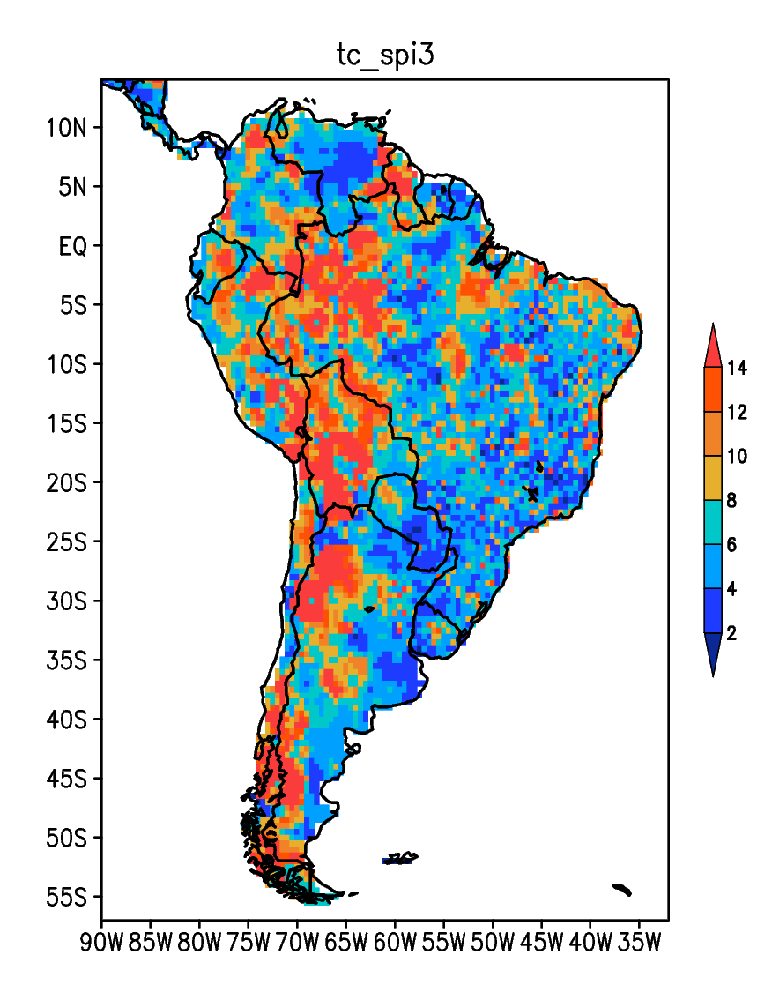

# Tempo Característico

Calcula e plota o Tempo Característico de um CTL



**Implementado por Eduardo Machado**  
**Ano: 2015**

**Alterações por:**
- **Heric Camargo**  
  **Ano: 2025**  
  **Detalhes:**
  - Makefile para compilação
  - Remoção de warnings e variáveis não utilizadas
  - Entrada de dados pelo terminal
  - Leitura das coordenadas a partir do arquivo CTL de entrada
  - Melhorias de qualidade de vida (Quality of Life improvements)

Este programa calcula o tempo característico de um diretório de arquivos CTL SPI (Standard Precipitation Index - Índice de Precipitação Padronizado) e plota os resultados em mapas usando o GrADS.

## Visão Geral do Processo

O fluxo do programa é o seguinte:

1. **Entrada de Dados**: O programa lê um diretório de arquivos CTL que foram gerados usando o programa `calcula_SPI`. 
2. **Cálculo do Tempo Característico**: O programa calcula o tempo característico para cada CTL.
3. **Saída de Dados**: O programa gera um arquivo de saída contendo o tempo característico para cada CTL.
4. **Plotagem dos Resultados**: O programa plota os resultados em mapas usando o GrADS.

Você pode ler mais sobre o [Calcula SPI](https://github.com/herijooj/calcula_SPI) no repositório correspondente.

## Requisitos

- **GrADS**: O GrADS é um software de visualização e análise de dados meteorológicos.
- **Compilador C**: Você provavelmente já tem um instalado no seu sistema.
- **Biblioteca de Matemática**: Você provavelmente já tem uma instalada no seu sistema.

## Como usar

1. **Gere os arquivos CTL**: Use o programa `calcula_SPI` para gerar os arquivos CTL.

2. **Execução**:
   No terminal, execute o comando:

   ```bash
   ./tempo_caracteristico <diretório de entrada> <diretório de saída> [intervalos] [-p]
   ```

   > **Atenção**: Este script deve ser executado na **Chagos**. Ele não funciona na minha máquina local.

    Substitua:
    - `<diretório de entrada>`: Pelo diretório contendo os arquivos CTL.
    - `<diretório de saída>`: Pelo diretório onde os arquivos de saída serão salvos.
    - `[intervalos]`: Pelo número de intervalos que você deseja usar para calcular o tempo característico. O padrão é usar todos os intervalos disponíveis.
    - `[-p]`: Define a porcentagem mínima de dados válidos para calcular o tempo característico. O padrão é 75%, caso não seja definido.

3. **Ajuda**:
      Para ver as opções de ajuda, execute:

```bash
        ./tempo_caracteristico -h
```

## Exemplo

```bash
(base) hericcamargo@chagos:~/TempoCaracteristico$ ./tempo_caracteristico.sh 
Uso: ./tempo_caracteristico.sh <input_directory> <output_directory> [intervals] [options]
   Este script executa e plota o tempo característico para arquivos .ctl contendo '_spi'.
   Ele gera arquivos .bin, .ctl e figuras correspondentes usando GrADS.
Atenção! Verifique se todos os comandos necessários estão disponíveis.
Opções:
  -h, --help            Exibe esta ajuda e sai
  -p, --porcentagem     Define a porcentagem mínima de dados (padrão: 75)
  intervals         (Opcional) Defina intervalos como '3 6 12' etc.
Exemplo:
  ./tempo_caracteristico.sh ./arquivos_ctl ./saida 3 6 12 -p 80
ERROR: Input directory cannot be empty.
```

4. **Arquivos de Saída**:
   Para um diretório com os arquivos CTL de entrada como:

```bash
.
├── dado_composto_ams_mensal_lab+gpcc_spi12.bin
├── dado_composto_ams_mensal_lab+gpcc_spi12.ctl
├── dado_composto_ams_mensal_lab+gpcc_spi24.bin
├── dado_composto_ams_mensal_lab+gpcc_spi24.ctl
├── dado_composto_ams_mensal_lab+gpcc_spi3.bin
├── dado_composto_ams_mensal_lab+gpcc_spi3.ctl
├── dado_composto_ams_mensal_lab+gpcc_spi48.bin
├── dado_composto_ams_mensal_lab+gpcc_spi48.ctl
├── dado_composto_ams_mensal_lab+gpcc_spi60.bin
├── dado_composto_ams_mensal_lab+gpcc_spi60.ctl
├── dado_composto_ams_mensal_lab+gpcc_spi6.bin
└── dado_composto_ams_mensal_lab+gpcc_spi6.ctl
```

   O programa irá gerar os arquivos de saída como:

```bash
.
├── figuras
│   ├── dado_composto_ams_mensal_lab+gpcc_spi12.eps
│   ├── dado_composto_ams_mensal_lab+gpcc_spi24.eps
│   ├── dado_composto_ams_mensal_lab+gpcc_spi3.eps
│   ├── dado_composto_ams_mensal_lab+gpcc_spi48.eps
│   ├── dado_composto_ams_mensal_lab+gpcc_spi60.eps
│   └── dado_composto_ams_mensal_lab+gpcc_spi6.eps
└── saida
    ├── dado_composto_ams_mensal_lab+gpcc_spi12_tc.bin
    ├── dado_composto_ams_mensal_lab+gpcc_spi12_tc.ctl
    ├── dado_composto_ams_mensal_lab+gpcc_spi24_tc.bin
    ├── dado_composto_ams_mensal_lab+gpcc_spi24_tc.ctl
    ├── dado_composto_ams_mensal_lab+gpcc_spi3_tc.bin
    ├── dado_composto_ams_mensal_lab+gpcc_spi3_tc.ctl
    ├── dado_composto_ams_mensal_lab+gpcc_spi48_tc.bin
    ├── dado_composto_ams_mensal_lab+gpcc_spi48_tc.ctl
    ├── dado_composto_ams_mensal_lab+gpcc_spi60_tc.bin
    ├── dado_composto_ams_mensal_lab+gpcc_spi60_tc.ctl
    ├── dado_composto_ams_mensal_lab+gpcc_spi6_tc.bin
    └── dado_composto_ams_mensal_lab+gpcc_spi6_tc.ctl
```

## Licença

Não faço ideia, esse código nem é meu direito.

## Melhorias Futuras

1. **Adicionar mais opções de plotagem**: Atualmente, o plot é *hardcoded* para os SPIS de 1, 3, 6, 9, 12, 24, 48 e 60 meses. Seria bom generalizar isso.
2. **Título e legenda**: Adicionar título e legenda aos gráficos.
3. **Paralelização**: Paralelizar o cálculo do tempo característico para acelerar o processo.
4. **Arquivos de logs no lugar certo**: Atualmente, os arquivos de log são salvos no diretório de execução. Seria melhor salvá-los no diretório de saída.